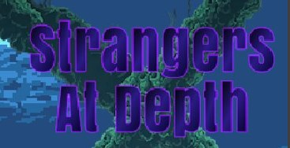

<!--
*** Thanks for checking out the Best-README-Template. If you have a suggestion
*** that would make this better, please fork the repo and create a pull request
*** or simply open an issue with the tag "enhancement".
*** Don't forget to give the project a star!
*** Thanks again! Now go create something AMAZING! :D
-->

<!-- PROJECT SHIELDS -->
<!--
*** I'm using markdown "reference style" links for readability.
*** Reference links are enclosed in brackets [ ] instead of parentheses ( ).
*** See the bottom of this document for the declaration of the reference variables
*** for contributors-url, forks-url, etc. This is an optional, concise syntax you may use.
*** https://www.markdownguide.org/basic-syntax/#reference-style-links
-->

<!--
[![Contributors][contributors-shield]][contributors-url]
[![Forks][forks-shield]][forks-url]
[![Stargazers][stars-shield]][stars-url]
[![Issues][issues-shield]][issues-url]
[![MIT License][license-shield]][license-url]
[![LinkedIn][linkedin-shield]][linkedin-url]
-->

<!-- PROJECT LOGO -->
 

    
    
  
 <b> Online Multiplayer 2D Mobile Game</b> 

<!-- TABLE OF CONTENTS -->

  
Table of Contents

  <ol>
    <li>
      <a href="#about-the-project">About The Project</a>
      <ul>
        <li><a href="#built-with">Built With</a></li>
      </ul>
    </li>
    <li>
      <a href="#getting-started">Getting Started</a>
      <ul>
        <li><a href="#prerequisites">Prerequisites</a></li>
        <li><a href="#installation">Installation</a></li>
      </ul>
    </li>
    <li><a href="#usage">Usage</a></li>
    <li><a href="#roadmap">Roadmap</a></li>
    <li><a href="#contributing">Contributing</a></li>
    <li><a href="#license">License</a></li>
    <li><a href="#contact">Contact</a></li>
    <li><a href="#acknowledgments">Acknowledgments</a></li>
  </ol>

<!-- ABOUT THE PROJECT -->
## About The Project

Stranger At Depth {SAD} is a fun mobile Android 2-D multiplayer battle royale platformer where players find treasure, gold coins called Krakens, hidden in the depths of the deep ocean while competing against other players online, but only one player’s loot will see the sunlight of day.

❖Registration Login: New users will need to sign up to create a new account with a username and password. Returning users must authenticate using their username and password to log in.

❖Home Screen: Users will be greeted with a main screen that includes the appropriately themed project title, animated background, background music, and different menu options that will allow the user to navigate the application.

❖Advertisements: Whenever the user is idle a closable pop-up ad will appear with the option to watch a video advertisement to earn game currency. The video option will appear randomly.

❖Play: Users will make and host a lobby for others to join.

❖Battle Royale: Players will load into the game, use items to fight other players, steal/collect gold coins called Krakens, avoid obstacles, and survive as the screen gradually scrolls up and eliminates players. There can only be one winner, if you are eliminated you will lose the Krakens you collected that game.

❖Player: Players have health and their number of collected Krakens. Players will also be able to dodge obstacles by moving, use unique items, and use a melee attack to steal another player’s Krakens.

❖Profile: Users can view their player information including wins, Krakens, achievements, and leaderboard rank. Here they can also change their profile picture, cosmetic accessories/skins, and claim a daily reward of Krakens for logging in.

❖Leaderboards: View your rank compared to other players based on total Krakens, total wins, or games played. Find other player’s rank.

❖Store: Use Krakens to purchase cosmetic accessories/skins.

❖Settings: Users can change their username/password, gameplay settings, background music, etc.

❖Termination: While playing a game, players have an option to quit the game or continue playing.

(<a href="#top">back to top</a>)

### Built With

* [Unity]
* [Photon PUN]
* [C#]
* [Visual Studio]
* [Firebase]

(<a href="#top">back to top</a>)

<!-- GETTING STARTED -->
## Getting Started

Please clone the repo and refer to these documents for further informations:
1. [Software Requirement Analysis](https://github.com/BirajSinghGCUTA/Strangers-At-Depth/blob/main/CSE%203310%20SRA%20FINAL.doc)
2. [Test Plan](https://github.com/BirajSinghGCUTA/Strangers-At-Depth/blob/main/CSE%203310%20Test%20Plan%20FINAL.doc)
3. [User Manual](https://github.com/BirajSinghGCUTA/Strangers-At-Depth/blob/main/UserManual.md)

### Prerequisites

1. Unity(Latest Version is prefered)
2. Andorid Emulator using android studio.
3. OS should be capapble of running Unity and Android.

### Installation

1. You need to export your application in Unity for Android platform – File/Build Settings… If you do not check “Export project” checkbox you will have “Build” button instead of “Export”.
2. Click “Export”.
3. Start Android Studio. Make sure that you already have everything set up – Android SDK and JAVA_HOME variable.
4. In Android Studio choose “Open an existing Android Studio project” then navigate to the just exported project folder.
5. Shift+10 or Run, choose Emulator (you can also choose your Device).

(<a href="#top">back to top</a>)

<!-- USAGE EXAMPLES -->
## Usage Examples
 
Please refer to the usermanual readme [Documentation](https://github.com/BirajSinghGCUTA/Strangers-At-Depth/blob/main/UserManual.md)_

(<a href="#top">back to top</a>)

<!-- ROADMAP -->
## Roadmap

Please refer to the SRA [Documentation](https://github.com/BirajSinghGCUTA/Strangers-At-Depth/blob/main/CSE%203310%20SRA%20FINAL.doc)_

(<a href="#top">back to top</a>)

<!-- CONTRIBUTING -->
## Contributing

Contributions are what make the open source community such an amazing place to learn, inspire, and create. Any contributions you make are **greatly appreciated**.

If you have a suggestion that would make this better, please fork the repo and create a pull request. You can also simply open an issue with the tag "enhancement".
Don't forget to give the project a star! Thanks again!

1. Fork the Project
2. Create your Feature Branch (`git checkout -b feature/AmazingFeature`)
3. Commit your Changes (`git commit -m 'Add some AmazingFeature'`)
4. Push to the Branch (`git push origin feature/AmazingFeature`)
5. Open a Pull Request

(<a href="#top">back to top</a>)

<!-- LICENSE -->
## License

Distributed under the MIT License. See `LICENSE.txt` for more information.

(<a href="#top">back to top</a>)

<!-- CONTACT -->
## Contact

Biraj Singh GC- [@birajsinghgc@gmail.com](birajsinghgc@gmail.com)

Project Link: [https://github.com/BirajSinghGCUTA/C-Heap](https://github.com/BirajSinghGCUTA/C-Heap)

(<a href="#top">back to top</a>)

<!-- ACKNOWLEDGMENTS -->
## Acknowledgments

### PROF. Dr. Bharam Khalili
### Team 12:
#### Antonio Yep
#### Biraj G C
#### Gerald Kimeu
#### Samuel Terwilliger
#### Henry Tran

(<a href="#top">back to top</a>)

<!-- MARKDOWN LINKS & IMAGES -->
<!-- https://www.markdownguide.org/basic-syntax/#reference-style-links -->
[contributors-shield]: https://img.shields.io/github/contributors/othneildrew/Best-README-Template.svg?style=for-the-badge
[contributors-url]: https://github.com/othneildrew/Best-README-Template/graphs/contributors
[forks-shield]: https://img.shields.io/github/forks/othneildrew/Best-README-Template.svg?style=for-the-badge
[forks-url]: https://github.com/othneildrew/Best-README-Template/network/members
[stars-shield]: https://img.shields.io/github/stars/othneildrew/Best-README-Template.svg?style=for-the-badge
[stars-url]: https://github.com/othneildrew/Best-README-Template/stargazers
[issues-shield]: https://img.shields.io/github/issues/othneildrew/Best-README-Template.svg?style=for-the-badge
[issues-url]: https://github.com/othneildrew/Best-README-Template/issues
[license-shield]: https://img.shields.io/github/license/othneildrew/Best-README-Template.svg?style=for-the-badge
[license-url]: https://github.com/othneildrew/Best-README-Template/blob/master/LICENSE.txt
[linkedin-shield]: https://img.shields.io/badge/-LinkedIn-black.svg?style=for-the-badge&logo=linkedin&colorB=555
[linkedin-url]: https://linkedin.com/in/othneildrew
[product-screenshot]: images/screenshot.png