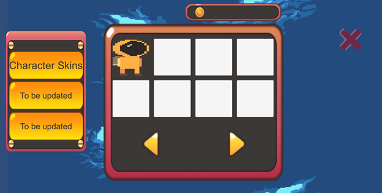
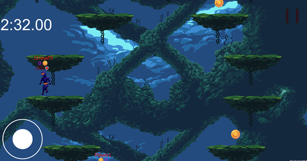

# User Manual
1. Upon opening the app for the first time, a new user will need to register by clicking the “Register” button

 

2. After choosing to register a new account, the user will need to fill in a username which is at least 3 characters long, a valid email address, and a password which is at least 6 characters long and contains a number. Once this data has been filled in, the user will need to select the “Register” button to create their account.

 

3. From the login screen, users with an existing account can choose to log in by typing in their existing username and password and clicking the Login button.

 

4. After a user logs in (either by registering a new account or signing into an existing one), they will be greeted with the home menu.

 

5. To exit the app, the user can click the “X” button in the top right corner of the screen. If the user chooses the “Cancel” button, they will be returned to the home menu. If the user chooses the “Confirm” button, the application will exit.

 

6. From the home menu, the user can click the “Profile” button. They will be greeted with the profile menu. To return to the home menu, the user can click the “X” button in the top right corner of the screen.

 

7. If the user clicks the “Achievements” button, they will be greeted with their unlocked achievements. To return to the profile screen, the user can click the “X” button in the top right corner of the screen.

 

8. If the user clicks the “Daily Rewards” button, a message will be displayed informing the user that they have either successfully claimed their rewards for the day or that they cannot claim their reward because it has already been claimed for that day.
 
 

9. From the home menu, the user can click the “Leaderboard” button to view the leaderboards. Once functioning, this will display statistics for all users of the game. To return to the home menu, the user can click the “X” button on the right side of the screen.
 
 

10. If the user clicks the “Store” button from the home menu, they will be directed to the store menu. The user can return to the main menu by clicking the “X” button in the top right corner of the screen.
 
 

11. If the user would like to change categories, they can click the category buttons on the left side of the screen which currently state “To be updated”. To return to the current category, the user can click the “X” button in the top right corner of the message.
 
 

12. By clicking the arrow buttons on the displayed category, the user can navigate shop items.
 
 

13. To purchase an item, the user can click on the item in the category display. This will present the user with the price of the item as well as the option to purchase the item. If the user possesses enough Krakens to purchase the item, it will be unlocked for their account. To cancel the purchase, the user can click the black “X” button on the top right of the item display.
 
 

14. In any menu, if the user remains inactive, an advertisement will pop up. These advertisements can be exited by clicking the “X” button in the top right corner of the advertisement.
 
 

15. From the home menu, the user can click the “Play” button. This will direct the user to the lobby menu. To return to the home menu, the user can click the “X” button in the bottom left corner of the screen.
 
 

16. The user can type a name into the text box labeled “Enter New Code…” and click the “Create” button to create a new room.
 
 

17. If a room is available, the user can choose to join a room by clicking on its name in the “Rooms” list.
 
 

18. While in a room, the user can view their selected avatar and the avatars of the other members of the room. The user can click the “Leave” button to return to the lobby menu, and once enough players have joined the room, the user who created the room can click the “Play” button to start the game.
 
 

19. The user can click the arrow buttons beside their avatar to change to unlocked avatars. By default, all accounts possess different colored scuba diver avatars.
 
 

20. When the “Play” button is clicked by the user who created the room, the game will begin.
 
 

21. The top left corner displays a timer which counts how long since the game began. Gold coins spawn on platforms and can be collected by touching them.
The user can click the joystick in the bottom left corner of the screen to move their player to different platforms.
 
 

22. The user can click on players to attack them. If the attack touches the other player, that player will lose health which is displayed as a number underneath the player’s name.
 
 

23. If the user clicks the button which appears as a pause symbol in the top right corner of the screen, they will be given options to quit. To return to the game, the user can click the “Resume” button. If the user clicks the “Quit” button, the app will close. If the user clicks the “Lobby” button, they will be returned to the lobby menu.
 
 

24. As players lose all their health, they are given the following screen. Clicking the “Lobby” button will return the user to the lobby menu, and clicking the “Quit” button will cause the app to close.

 

25. If the user plays until no other players are alive, they will be given the following screen. Clicking the “Lobby” button will return the user to the lobby menu, and clicking the “Quit” button will cause the app to close.  

 

